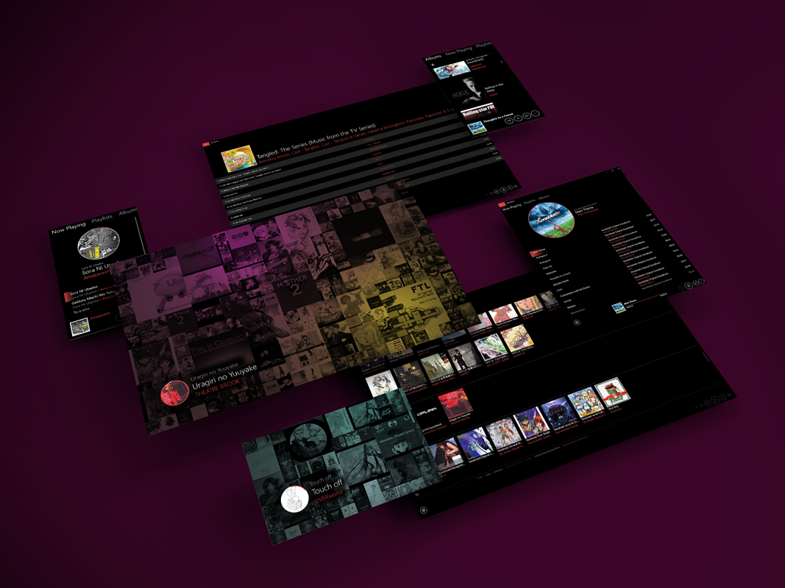

# Bes Music

Since  OneDrive no longer Supports streaming, and Groove killed downloading of music and syncing playlistst the same time,
I needed an alternative for Windows 10 Mobile and Win 10. And so Bes Music was created. It downloads your Music from OneDrive Syncing your Playlists and mimic the old Zune player a little bit.

I prefere having my Music always with me so it currently does not support streaming, but will download your music from OneDrive in advance.

It will need the latest Windows 10 Mobile Version. It ist Testet on an Lumia 950 DualSim and Win 10 1903.

  
*The mockup used to creates this picture was provided by [GRAPHBERRY](https://www.graphberry.com/item/web-screens-psd-mockup)*

 
## Feature List (and ToDo's)
 
  - [x] Play Music
  - [x] Sync Music
    - [x] Basic download of Music to local device
    - [x] Show what will be downloaded and how much space/bandwith it takes
    - [x] Syncronize Music library without downloading songs (those will not be playable)
    - [x] Download specific songs (e.g. Songs from a specific playlist) 
    - [x] Redownload corrupt music files (manually) 
 - [ ] Playlist
    - [x] Create Playlists
    - [x] Delete Playlists
    - [ ] Rename Playlists
    - [x] Add Songs to Playlist
    - [ ] Remove Songs from Playlist
    - [x] Sync Playlists
    - [x] Reset Playlist (delete local and sync from scratch)
    - [ ] Save current Playlist between starts
    - [ ] Save current Playlist cross device
    - [ ] Save sorting of list (currently its more a play set)
 - [ ] UI
    - [x] Responsive design from Phone to PC (including continuum)
    - [x] Zune like Now Playing
    - [ ] Fix inconsistent UI language
          Aiming for a more Metro style instead of fluent
    - [ ] Playlist View that lists all entrys in a specific playlist
    - [ ] Artists View
    - [ ] Jump between categorys (semantic zoom?)
    - [ ] Filter Album view *genres, offline available, etc...*
 - [ ] Performance improvements (esspecially for Phone)
 - [ ] Live Tile
 - [x] XBox supprot (Its technically working with pointer and no layout optimisation. Actual support is in a branch soon to be merged)
 - [x] Get a build in the Store
 - [ ] It would also be nice to support different provider besides OneDrive. Storage of information is already prepared for this. But it is not high on the TODO list.
 - [ ] Creating variants for Xamarin (and maybe Blazor)
 
 ## How to install
 

Or download the MSIX. 
 Since the MSIX requires an certificate and I do not have one of an big certificate authorety, you will need to install the provided certificate into trusted people.
 
 Of course you can also sign it yourself with your own certificate or build from source (which will also sign the package using your own certificate)
 
 
 ## How to build
 
 [See Wiki](https://github.com/LokiMidgard/WP10-Music-Player/wiki/How-to-build-this-repository)
